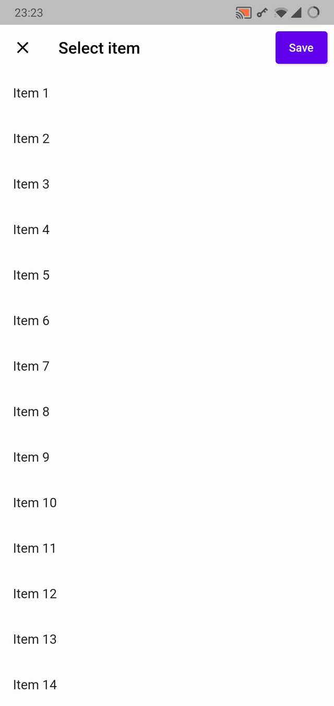

# appbar_elevation
[](https://pub.dev/packages/appbar_elevation)

A Flutter Widget for an AppBar that is initially flush with the body and 
elevated when scrolled.



## Usage

Use the `ScrollActivatedAppBarElevation` widget to wrap a Scaffold that contains 
a Scrollable view (e.g. `ListView`, `CustomScrollView`). The widget uses a 
NotificationListener to detect the scroll position and provides an 
`appBarElevation` value to be used.

## Example
```dart
@override
Widget build(BuildContext context) {
  return ScrollActivatedAppBarElevation(
    builder: (BuildContext context, double appBarElevation) {
      return Scaffold(
        appBar: AppBar(
          elevation: appBarElevation,
        ),
        body: ListView(
          children: [
            // ...
          ],
        ),
      );
    },
  );
}
```

See [example](example) for full code.

## License

BSD